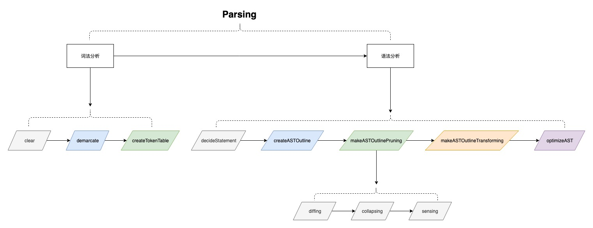

# PlayAST
PlayAST : 抽象语法树的设计与实现 ( PlayAST : Play With Abstract Syntax Tree )

## 介绍
学习 [AST](https://zh.wikipedia.org/wiki/%E6%8A%BD%E8%B1%A1%E8%AA%9E%E6%B3%95%E6%A8%B9) 原理并实现

## 原理
编译原理课程中，一个编译器主要内部处理分为 [词法分析](https://zh.wikipedia.org/wiki/%E8%AF%8D%E6%B3%95%E5%88%86%E6%9E%90) , [语法分析](https://zh.wikipedia.org/zh-hans/%E8%AA%9E%E6%B3%95%E5%88%86%E6%9E%90%E5%99%A8) 和 [语义分析](https://en.wikipedia.org/wiki/Semantic_analysis)。在编译的过程中，会生成中间代码，语法树(AST)就是其中的一种形式。以下为主要原理图：
<br><br>


## 作用
通过AST可以对任何具有语法的语句实现任何解析，从而达到处理目标。其常见作用如下：
- 优化语句，如实现对SQL的优化
- 编写针对特定语法的编译器
- 对语句进行格式化（格式化）处理

## 实现

### 1. SQL AST

起初是因为需要做前端SQL语法检查，故而最先选择了 SQL AST 用 JS 实现，并提供了 Debug 以调试解析过程中的详细处理。
运行 ```./src/sql/index.html``` 可以查看demo，SQL AST 核心可查看源码：```PlayAST/src/sql/SQLCompiler.js```，[点击查看](src/sql/SQLCompiler.js) 。

#### 解析过程
大概的解析过程如下图所示。


#### 可支持的功能列表
1. SQL语法检查
2. SQL代码格式化(格式化)
3. 生成大量 Fake SQL 以完成自动化测试
3. 通过AST树可以开发更多的特性 ...

#### 可支持的SQL语法列表
1. 子查询(最多3层)
2. UNION 和 UNION ALL(最多3层)
3. 子查询 和 UNION 同时使用 \[ 不超过3个,如select * from ( select * from test union select * from test ) ]
3. 支持 INSERT, DELETE, SELECT, UPDATE 4种操作, 除SELECT操作部分支持外, 其他3种操作都全部支持
4. 查询支持 *, AS, (LEFT,RIGHT,INNER)JOIN, WHERE, GROUP BY, HAVING, ORDER BY, LIMIT
5. 运算符支持 LIKE, >, =, <, >=, <=, !=, <>, IS NULL, IS NOT NULL, AND, &&, OR, BETWEEN, NOT BETWEEN, IN
6. 函数支持 distinct, count, from_unixtime, avg, sum, max, min, round, mid, len, first, last, format, concat, length, char_length, upper, lower, year, now

#### 示例


## 参考
[详见资料学习参考](./extra/docs/reference.md)


