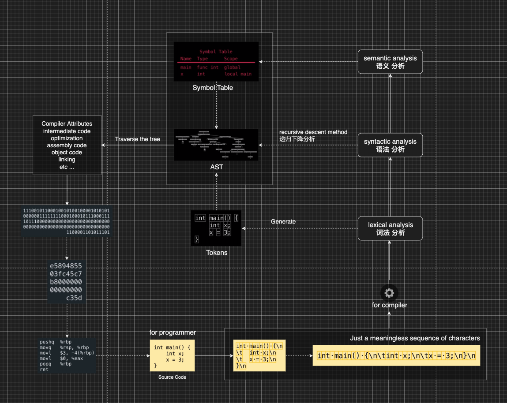

# PlayAST
PlayAST : Play With Abstract Syntax Tree

## 介绍
学习 [AST](https://zh.wikipedia.org/wiki/%E6%8A%BD%E8%B1%A1%E8%AA%9E%E6%B3%95%E6%A8%B9) 原理并实现

## 原理
编译原理课程中，一个编译器主要内部处理分为 [词法分析](https://zh.wikipedia.org/wiki/%E8%AF%8D%E6%B3%95%E5%88%86%E6%9E%90) , [语法分析](https://zh.wikipedia.org/zh-hans/%E8%AA%9E%E6%B3%95%E5%88%86%E6%9E%90%E5%99%A8) 和 [语义分析](https://en.wikipedia.org/wiki/Semantic_analysis)。在编译的过程中，会生成中间代码，语法树(AST)就是其中的一种形式。以下为主要原理图：
<br>


## 实现

#### SQL AST

起初是因为需要做前端SQL语法检查，故而最先选择了 SQL AST 用 JS 实现，并提供了 Debug 以调试解析过程中的详细处理 。具体查看源码：```PlayAST/src/sql/jsCompiler.js``` 。


## 参考
[详见资料学习参考](./extra/docs/reference.md)